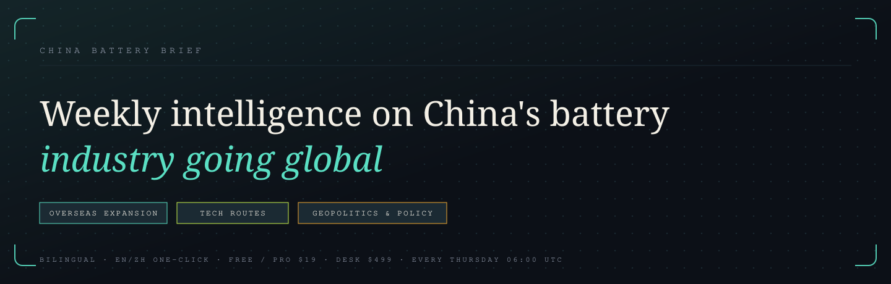

# China Battery Brief

<p align="center">
  
</p>

> A bilingual weekly intelligence newsletter on China's battery industry going global.

[Visit the live site](https://chinabatterybrief.com)

## What it covers

- **Overseas expansion** — where Chinese battery makers are building abroad
- **Technology** — LFP, solid-state batteries, and the routes that matter
- **Markets and policy** — trade rules, incentives, pricing, and geopolitics

Every issue is available in English and Chinese, with one-click language switching.

## Built with

React 19, TypeScript, Vite, Hono, tRPC, Drizzle ORM, and MySQL. The application is a single Node process serving both the site and its API.

## Quick start

Run these commands from `app/`:

```bash
npm install
npm run db:start
npm run db:seed
npm run dev
```

The development site runs at `http://localhost:3000`. Configure local variables from [`app/.env.example`](app/.env.example); never commit `.env`.

## Repository map

```text
app/       application code, database schema, and bilingual seed content
docs/      product, release, deployment, and security documentation
research/  topic-based research fact base for newsletter content
AGENTS.md  contributor conventions
```

## Documentation

- [Editorial and contributor rules](AGENTS.md)
- [Editorial workflow for bilingual issues](app/AGENTS.md)
